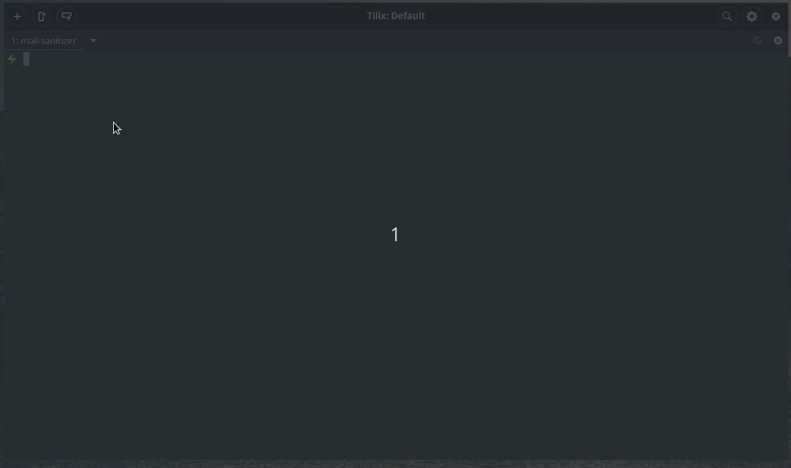

# Mail sanitizer



If you signup to a lot of websites to get a peek into the product or get on a trial. Then your mail box probably has several thousands of emails.
This tool will get all your emails, store it locally and let's you delete emails in bulk by sender and provide un-subscribe links if it finds any.

## One time setup

- Go [here](https://developers.google.com/gmail/api/quickstart/python) and click on Enable Gmail API

- Click on Download client configuration and copy the file over to ~/.config/mail-sanitizer/credentials.json

- Create a file called config.yaml in the same directory with the following contents

```yaml
email: <your email here>
```

Feel free to file issues if you face any problems or add suggestions in the github issues.